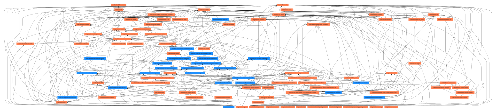
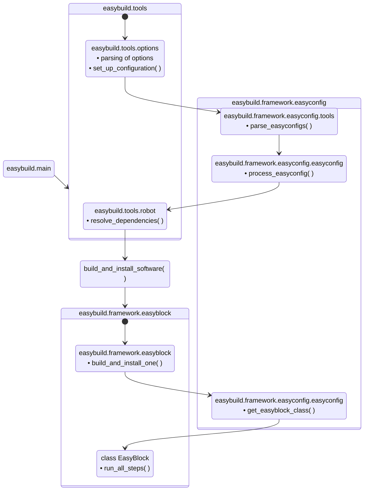
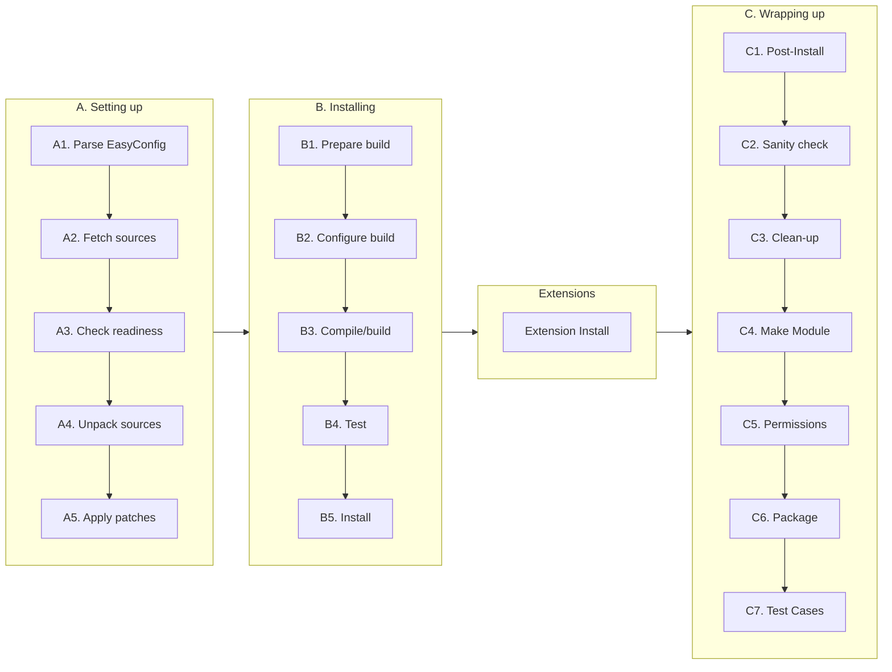
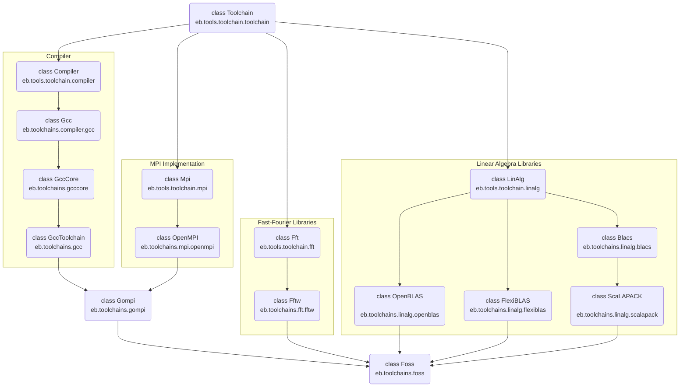

# EasyBuild Framework Overview {: #framework_overview }

## Package Structure

The `easybuild-framework` package provides the following `easybuild.*` Python
packages:

* **easybuild.framework** is the core of EasyBuild, which contains the
  machinery to build and install software by processing
  [EasyConfigs][easyconfig_files] and their [EasyBlocks][easyblocks].

* **easybuild.tools** is a toolbox of utilities used across the EasyBuild
  codebase (easybuild-framework and easybuild-easyblocks). Its functionality
  ranges from handling EasyBuild options and configuration, to file system
  operations, including the
  [integration with GitHub][integration_with_github],
  support for [hooks][hooks], etc.

* **easybuild.toolchains** contains all [toolchain][toolchains] definitions.

Overview of the package structure of EasyBuild framework (v4.7.1) — `easybuild.framework` shown in blue and `easybuild.tools` in orange:


## Workflow Overview {: #workflow_overview }

The following diagram shows the main steps carried out by EasyBuild for a
regular software installation with the `eb` command:



The process starts by calling the `set_up_configuration` function, which takes
care of configuration options passed to EasyBuild. Either through the command
line, configuration files or in the environment.

The scope of the EasyBuild execution is ultimately defined by the target
easyconfig files given in the `eb` command. They will define the number of
actions to carry out, such as software installations, fetching of sources or
opening of PRs. Therefore, target easyconfig files are parsed early in the
process, just after the runtime options have been resolved. The tooling to
parse easyconfig files is located in a specific `tools` module in
`easybuild.framework.easyconfig.tools`, while the `EasyConfig` class is found
in `easybuild.framework.easyconfig.easyconfig`.

Once the easyconfig files are properly parsed, a common action is to resolve
the dependencies for those installations with the [`--robot`][use_robot]
option. This is handled in `easybuild.tools.robot` which provides methods to
search easyconfig files, resolve dependencies, and check conflicts between
software packages.

The `resolve_dependencies` function returns an ordered list of all (parsed)
easyconfigs that have to be installed to fulfill the dependency requirements of
the requested installation (or throws an error if those dependencies cannot be
fulfilled). EasyBuild will iterate over that list carrying out each
installation in sequence.

The installation procedure of each software package is defined by the
[easyblock][easyblocks] attached to it. This means that EasyBuild creates an
`EasyBlock` instance for each individual installation and determines the
easyblock to use from the easyconfig file. Once the `EasyBlock` instance is
created, EasyBuild will call its `run_all_steps()` method to execute the
installation steps defined for that software.

### Step-wise Installation Procedure {: #step_wise_install }



## EasyBlock class

The base `EasyBlock` class in `easybuild.framework.easyblock` is a skeleton class
that cannot carry out any installation on its own, but that lays the ground for
child classes to define custom installation procedures. This does not mean that
the `EasyBlock` class is an empty shell though, it is actually one of the biggest
classes in EasyBuild with 4000+ lines of code (v4.7.x). It provides methods for
generic actions that are useful in most installations, independently of the
installation method.

Most of the steps in the initial [*Arrangement phase*][step_wise_install] are
already covered to some extent in the `EasyBlock` class, such as:

* A2. Fetch sources: `EasyBlock.fetch_sources`, `EasyBlock.fetch_patches`,
  `EasyBlock.obtain_file`

* A3. Check readiness: `EasyBlock.make_buildir`, `EasyBlock.reset_env`

* A4. Unpack sources: `EasyBlock.checksum_step`, `EasyBlock.extract_step`

Several steps in the last [*Cleaning phase*][step_wise_install] are already
covered by the base `EasyBlock` as well:

* C1. Post-Install: `EasyBlock.run_post_install_commands`,
  `EasyBlock.apply_post_install_patches`, `EasyBlock.fix_shebang`

* C2. Sanity check: `EasyBlock.sanity_check_step`,
  `EasyBlock.sanity_check_load_module`,
  `EasyBlock.sanity_check_linked_shared_libs`

* C3. Clean-up: `EasyBlock.cleanup_step`

* C4. Env. Module: `EasyBlock.make_module_step`

* C5. Permissions: `EasyBlock.permissions_step`

Therefore, custom easyblocks (child classes of `EasyBlock`) only need to define
some of the steps in the [*Build and Install phase*][step_wise_install], the
core of the workflow. Specifically, the configuration (B2), build (B3) and
install (B4) steps are the only mandatory steps in custom easyblocks. Check the
section [*Implementing EasyBlocks*][implementing_easyblocks] to start writing
your own custom easyblocks.

## Extension and ExtensionEasyBlock classes

The `EasyBlock` class has the machinery to trigger the installation of any
extensions found in the easyconfig file. The method `EasyBlock.run_all_steps`
always goes through `EasyBlock.extensions_step` which executes the installation
of each extension instance in `EasyBlock.ext_instances` (if any).

The installation process in the extension step starts in
`EasyBlock.install_extensions`, which will determine the installation approach
for the extensions (sequential or parallel based on given options/support) and
call the `Extension.run` method of each extension instance. This `run` method
is the one carrying out the actual installation of the extension and typically
executes the install step of the parent `EasyBlock` with some extra actions
before and/or after it. Nonetheless, custom easyblocks for extensions can fully
redefine their `run` method.

!!! warning
    In EasyBuild v5.0 the name of the `Extension.run` method will be changed
    to a more meaningful and less generic name.

Framework also provides the `ExtensionEasyBlock` class which inherits from both
`EasyBlock` and `Extension`. This class is useful for software that can be
either installed standalone with their own easyconfig file or as an extension:

* as extension: `ExtensionEasyBlock` uses the `Extension` class

* stand-alone: `ExtensionEasyBlock` uses the `EasyBlock` class

For instance, `PythonPackage`, `RPackage` or `PerlModule` are generic easyblocks
commonly used to install standalone packages or extensions of packages that use
other easyblocks. You will find many examples of both cases in our
[easyblock-easyconfigs](https://github.com/easybuilders/easybuild-easyconfigs/)
repository. 

## EasyConfig class

The `EasyConfig` class handles parsing and validating of easyconfig files. As
such, `EasyConfig` is independent from `EasyBlock` and it is actually needed to
determine the easyblock used in the installation of the target software
package.

Once the target easyconfig file is read and all its parameters are validated,
they will be accessible through different attributes and methods of the
EasyConfig object. The main examples are:

* `EasyConfig.name` returns the name of the package

* `EasyConfig.version` returns the version of the package

* `EasyConfig.toolchain` returns the toolchain used by the package

* `EasyConfig.dependencies()` returns the list of dependencies

!!! note
    The EasyConfig instance is also accessible from the corresponding EasyBlock
    instance through its `EasyBlock.cfg` attribute.

## EasyStack class

!!! warning
    EasyStacks are an experimental feature in active development.

The machinery for [EasyStacks][easystack] is located in the `easybuild.framework.easystack` module. It contains:

* `EasyStackParser`: class to parse the easystack files in YAML format

* `SoftwareSpecs`: attribute class with the specs of each software package in the easystack

* `EasyStack`: collection of `SoftwareSpecs` in the easystack

## Toolchain mechanism

A [toolchain][toolchains] in EasyBuild is much more than just a bundle of
libraries and compilers to build and run software in a consistent environment.
Toolchains are defined by their own classes built on top of the `Toolchain`
class.

The base `Toolchain` class is defined in `easybuild.tools.toolchain.toolchain`.
It does not only provide the attributes defining the toolchain (*i.e.* name and
version) but also provides methods to setup the build environment with that
toolchain :

* set the environment of the toolchain: `Toolchain.prepare`

    * validate dependencies for the toolchain: `Toolchain._check_dependencies`

    * load modules of the toolchain: `Toolchain._load_modules`

    * set environment variables (*e.g.* `$CC`, `$CFLAGS`):
      `Toolchain._setenv_variables`

    * handle build options: `Toolchain.prepare_rpath_wrappers`,
      `Toolchain.prepare_compiler_cache`, `Toolchain.handle_sysroot`

Hence, the base `Toolchain` class provides the skeleton to further develop
custom toolchain definitions through child classes. EasyBuild already provides
[many toolchains definitions][toolchains_table] that cover
[common][common_toolchains] and not-so-common combinations of compilers,
numeric libraries and MPI implementations. All toolchain definitions are found
in the `easybuild.toolchains` package of the EasyBuild framework.

Toolchains are modular. Each *toolchain component* (*i.e* compiler, numerical
library, MPI implementation) is defined by its own child class or by
multiple ones. These components are combined in sub-toolchains (*e.g.* the
`gompi` toolchain) which can then be re-combined with other components in
bigger toolchains (*e.g.* the `foss` toolchain). Therefore, the resulting options
of the toolchain, its attributes and methods will be the combined result of all
inherited class components.



## EasyBuild configuration options

Configuration options in EasyBuild can come from multiple sources:

* command line arguments to the `eb` command
* environment variables
* settings in configuration files
* settings in easyconfig files

!!! tip
    Check the [Configuring EasyBuild][configuring_easybuild] for details on how
    to use the different configuration mechanisms.

All configuration options in EasyBuild are defined in `easybuild.tools.options`.
The `EasyBuildOptions` class gathers all options, including the name of the
argument and its help string.

The `easybuild.tools.options` module also handles the parsing of options
through its `set_up_configuration()` method, which is called in the
[very early stages][workflow_overview] of the `eb` execution. The main step is
`parse_options()` to read and validate the command line itself.

Once all options are parsed, those options listed in `easybuild.tools.config`
will be gathered in a singleton `BuildOptions` class. This class is the
centralized location of configuration options for the current EasyBuild
session. The method `build_option()` in `easybuild.tools.config` provides a
simple interface to it:

```python
if build_option('ignore_test_failure'):
    print_warning("Test failure ignored")
else:
    raise EasyBuildError("Test failure")
```

Therefore, adding a new option to `eb` and making that options available
through `build_option()` is a two step process. First the option has to be
added to `EasyBuildOptions` in `easybuild.tools.options` and then also listed
in `easybuild.tools.config`. As an example, you can check
[easybuild-framework#4226](https://github.com/easybuilders/easybuild-framework/pull/4226)
which is a PR adding the `download_timeout` option to EasyBuild.

## Features in easybuild.tools

### Environment modules

#### Interface

[`easybuild.tools.modules`](/api/easybuild/tools/modules/) provides the
interface to the different [environment module tools][modules_tool] supported
in EasyBuild. The `ModulesTool` class is an abstraction layer to interact with
the environment modules in the host system.

Additionally, `easybuild.tools.modules` also provides methods to retrieve
information about loaded software in the EasyBuild environment, such as
`get_software_root()` or `get_software_version()`, which are extensively used
in easyblocks.

#### Naming scheme

[`easybuild.tools.module_naming_scheme`](/api/easybuild/tools/module_naming_scheme/)
contains the definitions of the [module naming schemes][module_naming_scheme]
(MNS) supported in EasyBuild. You will find in it one module per MNS. The
structure of the naming scheme is defined in corresponding classes based on
`ModuleNamingScheme`.

#### Module generator

[`easybuild.tools.module_generator`](/api/easybuild/tools/module_generator/)
is the engine used by EasyBuild to write module files.
It provides the `ModuleGeneratorLua` and `ModuleGeneratorTcl` classes for each
of the supported module file formats. The module generator is mainly used in
the [make module step][step_wise_install] of the installation process.

### Host system

#### System information

[`easybuild.tools.systemtools`](/api/easybuild/tools/systemtools/) provides a
toolset to check multiple aspects of the underlying operative system, such as
CPU specs, amount of memory, OS characteristics and system libraries.

#### Environment

[`easybuild.tools.environment`](/api/easybuild/tools/environment/) provides an
interface to access and modify the environment in the host system.

#### File system

[`easybuild.tools.filetools`](/api/easybuild/tools/filetools/) provides
multiple methods to interact with the underlying file system in the host. This
abstraction layer sits on top of lower interfaces provided by the standard
Python library.

### Job schedulers

[`easybuild.tools.job`](/api/easybuild/tools/job/) contains the interfaces to
the different job schedulers supported in EasyBuild.

### Containers

[`easybuild.tools.containers`](/api/easybuild/tools/containers/) contains the
interfaces to the different container systems supported in EasyBuild.

### GitHub integration

[`easybuild.tools.github`](/api/easybuild/tools/github/) provides the interface
to remote repositories in GitHub. It allows to fetch easyconfig files from PRs,
open new PRs, upload test reports and several other maintainer actions on PRs.

### Hooks

[`easybuild.tools.hooks`](/api/easybuild/tools/hooks/) contains the definition
of all accessible [hooks][hooks] in EasyBuild. The actual call to the hooks
defined by the user are spread across the [steps of the installation
process][step_wise_install]. Hence, this module is only interesting if you
want to add or modify the available hooks.

## Contributing to Framework

### Reporting issues and bugs

Reporting issues and bugs to `easybuild-framework` is no different than to any
other bug tracker. You should provide as many information as needed to allow
the developers to reproduce your issue/bug, including:

1. a description of what you are trying to do
1. a description of the steps to reproduce the problem
1. EasyBuild configuration and host system information
1. custom easyblock or easyconfig files
1. full error messages and tracebacks

In the case of EasyBuild, the main complication to report issues and bugs might
be to determine if the issue/bug at hand does actually originate in
easybuild-framework or if instead it belongs in easybuild-easyblocks or
easybuild-easyconfigs. It is not uncommon that the traceback of bugs in
easyblocks or easyconfigs reach the codebase in `easybuild.framework` or
`easybuild.tools`.

Nevertheless, do not worry too much if you cannot determine which repository to
target with your issue/bug. In case of doubt, `easybuild-framework` is the best
bet in general and maintainers can move issues between EasyBuild repositories
if needed.

### Pull requests

Contributing bug fixes or new features to `easybuild-framework` is **always
welcomed**. However, keep in mind that due to the broader scope of the source
code in framework, making contributions might be a bit more complicated than
for easyblocks and easyconfigs:

* EasyBuild does not currently provide integration in the `eb` command to make
  contributions to the `easybuild-framework` repository. Therefore, as
  contributor, you have to manually fork `easybuild-framework` and open the pull
  request from your fork. The GitHub documentation contains a detailed
  description on how to
  [create PRs from forks](https://docs.github.com/en/pull-requests/collaborating-with-pull-requests/proposing-changes-to-your-work-with-pull-requests/creating-a-pull-request-from-a-fork).

* We recommend to link all new PRs in `easybuild-framework` to a corresponding
  issue in the issue tracker. Splitting the issue from the PR helps focus the
  activity in the PR to the changes in the source code and keep it separate
  from the discussion about the underlying problem.

* The source code of `easybuild-framework` must be covered by the [unit
  tests][unit_tests] in `test.framework` and all tests must pass.
  You can [run the unit tests][unit_tests_running] in EasyBuild on your
  computer to check their [results](unit_tests_results) before opening the PR
  to our repository. In general, this requirement on unit tests has the
  following implications depending on the type of changes introduced in your
  PR:

    * **Bug fix**: the presence of a bug means that either that part of the
      codebase is currently uncovered by the tests or that it is already
      covered but tests are also buggy.

    * **New feature**: new unit tests have to be added covering the new feature.

    Therefore, in (almost) all cases, new PRs to framework have to also include
    related changes in unit tests. The suite of unit tests in framework is
    already very extensive and you will find all tests organized per module in
    the `test/framework` directory.

    If you are not familiar with writing tests in Python, you can find all the
    details in the [`unittest` documentation](https://docs.python.org/3/library/unittest.html).
    We also recommend the guide [Getting Started With Testing in
    Python](https://realpython.com/python-testing/) as a more comprehensive
    alternative.

