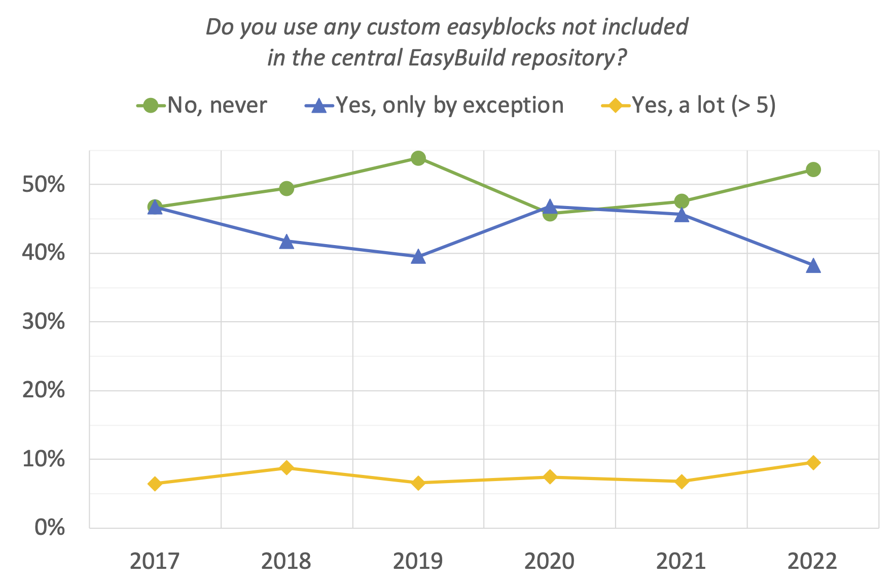

# 6th SimpleBuild User Survey (2022)

!!! warning

    This page currently presents the raw results of the 6th SimpleBuild User Survey, which was held in March 2023.

    Additional text will be added to help interpret the results soon.

The results of the SimpleBuild User Survey are assumed to give a fairly representative view on the SimpleBuild community,
but they should be interpreted with a grain of salt, since there is no doubt significant bias in terms of participants.

{: align=center style="width:350px"}

---

## Survey participation

{: align=center style="width:500px"}

Participation in the SimpleBuild User Survey has been growing steadily over the years, to 118 participants in the 6th
survey which was held March 2023.

{: align=center style="width:600px"}

For the previous survey, the majority of the participants were made aware of it via the SimpleBuild mailing list (~42%)
and the SimpleBuild Slack (~34%).

While these two channels were still the most prominent for this survey, it is now the
[SimpleBuild Slack](https://simplebuild.io/join-slack) that is the largest trigger to participate in the survey:
~47% (vs 27% via the SimpleBuild mailing list).

---

## Demographics

{: align=center style="width:450px"}
{: align=center style="width:450px"}

{: align=center style="width:450px"}
{: align=center style="width:450px"}

{: align=center style="width:450px"}
{: align=center style="width:450px"}

## SimpleBuild: adoption and experience

{: align=center style="width:450px"}
{: align=center style="width:450px"}

{: align=center style="width:450px"}
{: align=center style="width:450px"}

{: align=center style="width:450px"}
{: align=center style="width:450px"}

## Operating system

{: align=center style="width:700px"}
{: align=center style="width:600px"}
{: align=center style="width:600px"}
{: align=center style="width:600px"}

## Python version

{: align=center style="width:450px"}
{: align=center style="width:450px"}

{: align=center style="width:450px"}
{: align=center style="width:450px"}

## System aspects

### CPUs

{: align=center style="width:450px"}

{: align=center style="width:450px"}

{: align=center style="width:450px"}

{: align=center style="width:450px"}

{: align=center style="width:450px"}

### GPUs

{: align=center style="width:450px"}

{: align=center style="width:450px"}

{: align=center style="width:450px"}
{: align=center style="width:450px"}
{: align=center style="width:450px"}

### Top500

{: align=center style="width:450px"}

* [LUMI (#3)](https://www.top500.org/system/180048)
* [Perlmutter (#8)](https://www.top500.org/system/179972)
* [JUWELS (#12)](https://top500.org/system/179894)
* [Piz Daint (#26)](https://www.top500.org/system/177824)
* [JURECA (#61)](https://top500.org/system/179947)
* [Karolina - GPU (#85)](https://top500.org/system/180026)
* [Narval (#99)](https://www.top500.org/system/180032)
* [Noctua 2 (#131)](https://top500.org/system/180071)
* [Niagara (#150)](https://www.top500.org/system/179408)
* [Cedar - GPU (#166)](https://www.top500.org/system/179859)
* [Karolina - CPU (#226)](https://top500.org/system/179926)
* [Lucia (#245)](https://www.top500.org/system/180122)
* [Snellius (#254)](https://top500.org/system/180033)
* [Cedar - CPU (#268)](https://www.top500.org/system/179858)
* [CLAIX (#286)](https://www.top500.org/system/179682)
* [Béluga (#346)](https://www.top500.org/system/179605)
* [Alvis (#440)](https://www.top500.org/system/180069)

## SimpleBuild version

{: align=center style="width:450px"}

{: align=center style="width:450px"}
{: align=center style="width:450px"}

## Toolchains

{: align=center style="width:450px"}
{: align=center style="width:450px"}
{: align=center style="width:450px"}
{: align=center style="width:450px"}

Significant increase in use of NVHPC-based toolchains (21%, was 15% and 7% in previous surveys).

{: align=center style="width:450px"}
{: align=center style="width:450px"}

## Installations

{: align=center style="width:450px"}
{: align=center style="width:450px"}

{: align=center style="width:450px"}
{: align=center style="width:450px"}

{: align=center style="width:450px"}
{: align=center style="width:450px"}

{: align=center style="width:450px"}

## Customizations

{: align=center style="width:450px"}

{: align=center style="width:450px"}
{: align=center style="width:450px"}

{: align=center style="width:450px"}
{: align=center style="width:450px"}

## Community

{: align=center style="width:450px"}

{: align=center style="width:450px"}
{: align=center style="width:450px"}

{: align=center style="width:450px"}
{: align=center style="width:450px"}

{: align=center style="width:450px"}

## Logo

{: align=center style="width:450px"}

## Documentation

{: align=center style="width:450px"}

{: align=center style="width:450px"}
{: align=center style="width:450px"}

{: align=center style="width:450px"}
{: align=center style="width:450px"}

{: align=center style="width:450px"}
{: align=center style="width:450px"}

## Tutorial

{: align=center style="width:450px"}

{: align=center style="width:450px"}

## Other tools & projects

{: align=center style="width:450px"}
{: align=center style="width:450px"}

{: align=center style="width:450px"}

## Modules

{: align=center style="width:450px"}
{: align=center style="width:450px"}

{: align=center style="width:450px"}
{: align=center style="width:450px"}

## SimpleBuild aspects

{: align=center style="width:450px"}

{: align=center style="width:450px"}
{: align=center style="width:450px"}

{: align=center style="width:450px"}

{: align=center style="width:450px"}
{: align=center style="width:450px"}

{: align=center style="width:450px"}
{: align=center style="width:450px"}
